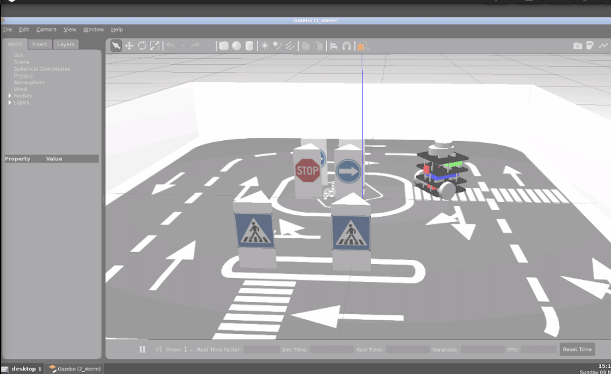
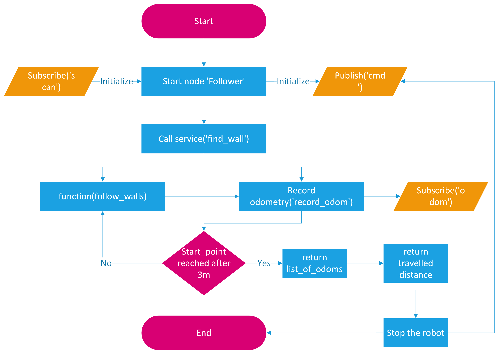
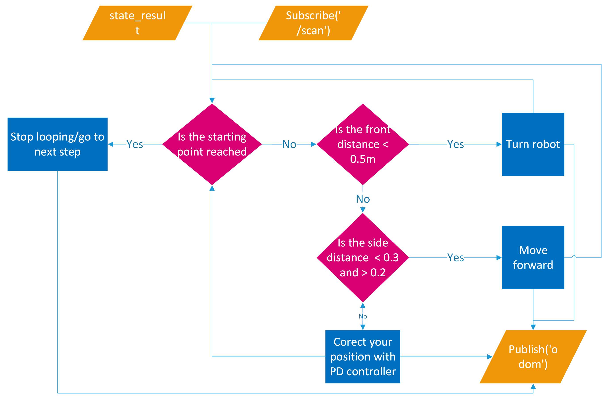
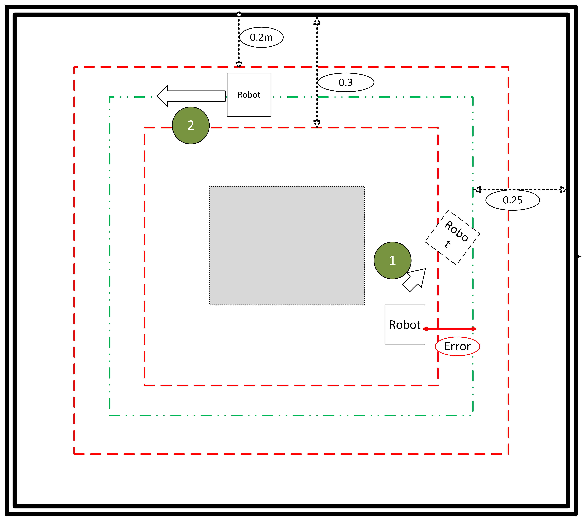
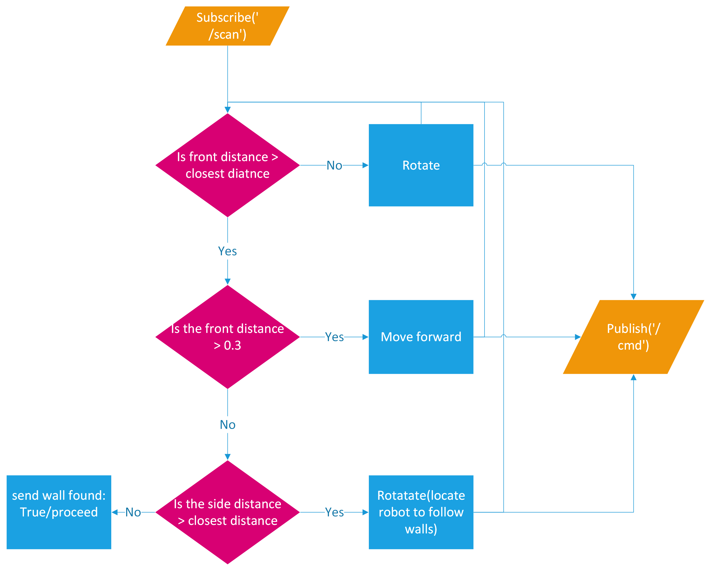
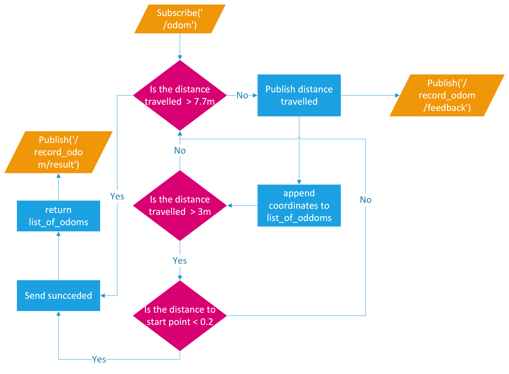

# TurtleBot3

# Goal
The goal of this project is to program TurtleBot3 to follow walls inside a confined square area. This autonomous navigation should run in Gazebo simulation and in a real Mobile robot. It should do the following: 
- Use a service to find a suitable starting point. 
- Have a algorithm to following the walls, make the turnings and descide when to stop 
- Use an action to record all the world cartesian coordinates it came across. Beside calculating the length travelled by TurtleBot3 

# High Level Control Logic

# Wall Following Function

# PID Controller
The PID controller will intervene when called by the wall following functioning to correct the orientation of TurtleBot3 to ensure it navigates along the ideal desired path(in Green Line)<b>

# Service Server
The service enables TurtelBot3 to find a suitable start point close to the nearsest wall<b>

# Action Server
The action records the [x, y, z] coordinates, each second, that the robot came across. It also claulates the distance travelled by the robot from the starting point.<b>

# Challenges 
-Procedural programming was messy and hard to debug. Object oriented programmign was the solution to orginze the code and make eay to be understood.<b>  
-PID controller proved to be hard to be tuned manually. A better approach would be to use PID-Tuner software.<b>

# Demo in simulation
https://github.com/user-attachments/assets/ae10a0d1-7d69-4f9b-94b2-501f9c5f5312

# Demo in real robot
https://github.com/user-attachments/assets/60fa9316-c072-4670-b1e6-fdf333311a35